<div id="header" align="center">
  <h1>
    <p align="center">
      # 👋 Mohammed Hosny - Flutter Developer
    </p>
  </h2>

  <div align="center">
    
  </div>

  [](https://git.io/typing-svg)

  [](https://www.linkedin.com/in/mohammed-hosny-93b790227/)
  [](mailto:mohammedhosny009@gmail.com)
  [](https://wa.me/201550218882)
  [](https://t.me/MHosny24)
  [](https://drive.google.com/file/d/1bSr3G5tztGOtNVyTA1x2olhmjYnupDwg/view?usp=drive_link)
  [](https://portfolio-io-10f01.web.app/)

  

</div>

---

## 🚀 About Me

> 💻 **Software Engineer | Mobile Application Developer** from Egypt with **4+ years** of experience in building, leading, and delivering high-quality mobile applications

- 🎯 **Expertise**: Cross-platform mobile apps (Android, iOS)
- 📱 **Specialization**: Flutter development, Clean Architecture, and modern best practices
- 🏆 **Achievement**: Team Leader at UTD Software Company
- 🎓 **Education**: Software Engineer and Mobile Application Developer
- 👨‍🏫 **Leadership**: Leading development teams, ensuring high-quality code and scalable solutions

```mermaid
graph LR
    A[💡 Idea] --> B[🎨 Design]
    B --> C[⚡ Flutter Development]
    C --> D[🧪 Testing]
    D --> E[🚀 Deployment]
    E --> F[📊 Analytics]

    style A fill:#FF6B6B
    style B fill:#4ECDC4
    style C fill:#45B7D1
    style D fill:#96CEB4
    style E fill:#FECA57
    style F fill:#FF9FF3
```



---

## 🎯 Technical Skills

### 📱 **Mobile Development**
```
Flutter & Dart        ████████████████████ 95%
State Management      ████████████████████ 90%
Clean Architecture    ████████████████████ 95%
Performance Tuning    ████████████████████ 85%
```

<details>
<summary><strong>🔧 Core Technologies</strong></summary>

| Technology | Proficiency | Experience |
|------------|-------------|------------|
| **Flutter** | ⭐⭐⭐⭐⭐ | 4+ years |
| **Dart** | ⭐⭐⭐⭐⭐ | 4+ years |
| **State Management** (BLoC/Cubit, Provider, GetX) | ⭐⭐⭐⭐⭐ | 4+ years |
| **Firebase** | ⭐⭐⭐⭐⭐ | 4+ years |
| **REST API** | ⭐⭐⭐⭐⭐ | 4+ years |
| **Clean Architecture** | ⭐⭐⭐⭐⭐ | 4+ years |
| **Git Version Control** | ⭐⭐⭐⭐⭐ | 4+ years |
| **Supabase** | ⭐⭐⭐⭐ | 3+ years |
| **Local Storage** (SQLite, Hive) | ⭐⭐⭐⭐ | 3+ years |
| **Unit Testing** | ⭐⭐⭐⭐ | 3+ years |
| **UI/UX Design** | ⭐⭐⭐⭐ | 4+ years |
| **Android Studio** | ⭐⭐⭐⭐⭐ | 4+ years |
| **VS Code** | ⭐⭐⭐⭐⭐ | 4+ years |
| **Xcode** | ⭐⭐⭐⭐ | 4+ years |
| **Postman** | ⭐⭐⭐⭐ | 4+ years |

</details>

### 🛠️ **Tech Stack**

<div align="center">

#### **Languages & Frameworks**


#### **State Management**


#### **Backend & Services**


#### **Database & Storage**


#### **Architecture & Testing**


#### **Tools & Platforms**


#### **Project Management**


#### **Design & UI/UX**


</div>

---

## 💼 Professional Experience


### 🏢 **Current Positions**

<table>
<tr>
<td width="50%">

#### 🚀 **Sourcya**
**Mobile Application Developer** _(11/2025 - Present)_
- Contributing to cross-platform mobile applications
- Building scalable and maintainable solutions
- Remote work from Alexandria, Egypt

</td>
<td width="50%">

#### 📱 **SINAD App**
**Mobile Application Developer** _(02/2025 - Present)_
- Leading development of Sinad mobile platform
- Dual-app ecosystem for service requests
- Real-time tracking and notifications

</td>
</tr>
</table>

---

## 📚 Featured Projects

<div align="center">

### 🏆 **Production Apps**

| App | Platform |
|-----|----------|
| **Sinad Client** | [](https://play.google.com/store/apps/details?id=com.sinadapp.clients) [](https://apps.apple.com/eg/app/sinad-request-a-service/id6477547322) |
| **Sinad Provider** | [](https://play.google.com/store/apps/details?id=com.sinadapp.providers) [](https://apps.apple.com/eg/app/sinad-service-provider/id6477547282) |
| **TMTGPS** | [](https://play.google.com/store/apps/details?id=com.altatawwar.tmt.track.app) [](https://apps.apple.com/eg/app/tmtgps/id6453688070) |
| **Kold** | [](https://play.google.com/store/apps/details?id=com.altatawwar.kold.app) [](https://apps.apple.com/eg/app/kold/id6754703360) |
| **Nasni** | [](https://play.google.com/store/apps/details?id=com.altatawwar.nasni.app) [](https://apps.apple.com/eg/app/nasni/id6754703562) |
| **Mada'n Workforce** | [](https://play.google.com/store/apps/details?id=com.altatawwar.madaan.workforce.app) [](https://apps.apple.com/eg/app/madan-workforce/id6757802559) |
| **Bnoni Sway Doctors** | [](https://play.google.com/store/apps/details?id=com.bnoniswaydoctors.app) [](https://apps.apple.com/eg/app/bnoni-sway-doctors/id6479611039) |
| **Bnoni Sway Users** | [](https://play.google.com/store/apps/details?id=com.bnoni.sway) [](https://apps.apple.com/eg/app/bnoni-sway-%D8%A8%D9%86%D9%88%D9%86%D9%8A-%D8%B3%D9%88%D8%A7%D9%8A/id6479611102) |
| **Arabic Mutton** | [](https://play.google.com/store/apps/details?id=com.arabic.mutton) |
| **Wjhtak** | [](https://play.google.com/store/apps/details?id=com.wjhtak.app) [](https://apps.apple.com/eg/app/%D9%88%D8%AC%D9%87%D8%AA%D9%83/id6590636750) |
| **Shattoor** | [](https://play.google.com/store/apps/details?id=com.appuniq.shattoorapp) [](https://apps.apple.com/eg/app/%D8%B4%D8%B7%D9%88%D8%B1-shattoor/id6478968853) |
| **Vibe Life** | [](https://play.google.com/store/search?q=vibe%20life&c=apps) |
| **Sophia Chat** | [](https://play.google.com/store/apps/details?id=com.sophia.chat) |

</div>

<details>
<summary><strong>📝 Project Details</strong></summary>

### 🏖️ **Sinad Client**
> Smart and user-friendly mobile application that enables users to easily request services, track requests in real-time, and receive instant updates
- **Features**: Multi-category services, trusted providers connection, real-time tracking, instant notifications
- **Tech Stack**: Flutter, Firebase, REST API, Clean Architecture, BLoC
- **Achievement**: Successfully deployed on both Android and iOS

### 👨‍💼 **Sinad Service Provider**
> Dedicated mobile application for professionals to receive service requests, manage daily tasks, and track job progress in real-time
- **Features**: Service management, client communication, real-time tracking, performance monitoring
- **Architecture**: Clean Architecture with BLoC state management
- **Impact**: Helping providers grow their business efficiently

### 🚗 **TMTGPS**
> Professional fleet and asset tracking application used across Saudi Arabia
- **Features**: Real-time GPS monitoring, automated alerts, performance insights, comprehensive reporting
- **Tech Stack**: Flutter, Google Maps, Geolocation, Geofencing, WebSockets
- **Deployment**: Used across Saudi Arabia for fleet optimization

### 🌡️ **Kold**
> Smart monitoring application for tracking temperature and humidity across warehouses and sensitive storage areas
- **Features**: Live readings, instant alerts, historical reports, actionable insights
- **Focus**: Asset safety and optimal storage conditions

### 🏥 **Nasni**
> Smart indoor tracking solution for real-time monitoring of assets and people within buildings
- **Features**: Live map tracking, instant alerts, dashboard insights, detailed reports
- **Use Cases**: Hospitals, offices, warehouses, and other facilities

### 👷 **Mada'n Workforce**
> Smart workforce management application for coordinating jobs, tasks, and operations in real time
- **Features**: Centralized dashboard, proof of work, structured workflows, task tracking
- **Impact**: Operational excellence across multiple sites

### 👩‍⚕️ **Bnoni Sway Doctors**
> Specialized medical app for gynecology doctors and patients seeking non-emergency consultations
- **Features**: Real-time question dispatch, seamless communication, doctor verification, rating systems
- **Specialty**: Healthcare-focused mobile solution, completely free

### 👤 **Bnoni Sway Users**
> Provides users with seamless access to gynecology medical consultations
- **Features**: Submit questions, receive real-time responses, track answers
- **Focus**: Smooth, accessible, and free healthcare experience

### 🐑 **Arabic Mutton**
> Go-to app for ordering slaughtered animals and 'Aqiqah' services quickly and securely
- **Features**: Schedule recurring orders, safe e-payment, religious and festive occasions
- **Specialty**: Simplifying religious and festive occasions

### ✈️ **Wjhtak**
> Innovative travel platform connecting tourism companies with clients
- **Features**: Domestic and international trips, hotel and flight bookings, personalized itineraries
- **Additional**: User reviews, exclusive offers, 24/7 customer support

### 🎮 **Shattoor**
> Educational app that motivates children to complete tasks and develop skills through a reward system
- **Features**: Progress tracking, goal setting, achievement rewards
- **Focus**: Building positive habits, self-discipline, and essential life skills

### 🎉 **Vibe Life**
> Social platform combining live audio chat rooms and short video content
- **Features**: Live discussions, creativity sharing, real-time interactions
- **Community**: Vibrant global community in a safe environment

### 💬 **Sophia Chat**
> Dynamic social platform combining live audio chat rooms and short video sharing
- **Features**: Real-time conversations, inspiring content, interactive discussions
- **Environment**: Secure and user-friendly

</details>

---

## 🏆 Key Achievements

<div align="center">

| 🎯 Achievement | 📊 Impact | 🗓️ Timeline |
|----------------|-----------|-------------|
| **Team Leadership** | Leading development teams at UTD Software | 2024-2026 |
| **Production Apps** | 13+ apps on Play Store & App Store | 2022-Present |
| **Saudi Market Expert** | 3 companies experience in Saudi | 2023-Present |
| **Enterprise Solutions** | Fleet tracking, workforce management, IoT monitoring | 2024-2026 |
| **Social Apps Specialist** | Multiple social platforms developed | 2022-Present |

</div>


---

## 📊 GitHub Analytics

<div align="center">


</div>

---

## 🌐 Languages

| Language | Proficiency | Usage |
|----------|-------------|-------|
| 🇪🇬 **Arabic** | Native | Professional & Personal |
| 🇺🇸 **English** | Professional | Technical Documentation & Communication |

---

## 💼 Why Choose Mohammed?

```mermaid
mindmap
  root((Mohammed Hosny))
    🎯 Expertise
      4+ Years Experience
      Production Apps
      Team Leadership
    🤝 Collaboration
      Team Management
      Cross-functional Teams
      Problem Solving
    🚀 Innovation
      Enterprise Solutions
      Modern Technologies
      Continuous Learning
    📱 Specialization
      Flutter Expert
      Cross-platform
      UI/UX Focus
```

<div align="center">



</div>

### ✨ **Core Strengths**
- 🎯 **Proven Track Record**: 13+ production apps deployed on both platforms
- 👥 **Team Leadership**: Successfully led development teams at UTD Software
- 🌍 **International Experience**: 3+ years experience in Saudi Arabian market
- 🏗️ **Architecture Expert**: Clean Architecture, MVVM, MVC, SOLID principles
- 🏢 **Enterprise Solutions**: Fleet tracking, workforce management, IoT monitoring
- 💬 **Social Apps Specialist**: Expert in real-time communication and streaming apps

---

## 📞 Let's Connect!

<div align="center">

### 🤝 **Ready to collaborate? Let's build something amazing together!**

[](mailto:mohammedhosny009@gmail.com)
[](https://www.linkedin.com/in/mohammed-hosny-93b790227/)
[](https://wa.me/201550218882)
[](https://t.me/MHosny24)
[](https://drive.google.com/file/d/1bSr3G5tztGOtNVyTA1x2olhmjYnupDwg/view?usp=drive_link)

</div>

---

<div align="center">

**⭐ Star this repository if you found it helpful!**

*Last updated: February 2026*

</div>
