```mermaid
graph LR
    A[💡 Idea] --> B[🎨 Design]
    B --> C[⚡ Flutter Development]
    C --> D[🧪 Testing]
    D --> E[🚀 Deployment]
    E --> F[📊 Analytics]

    style A fill:#FF6B6B
    style B fill:#4ECDC4
    style C fill:#45B7D1
    style D fill:#96CEB4
    style E fill:#FECA57
    style F fill:#FF9FF3
```

<div id="header" align="center">
  <h1>
    <p align="center">
      
# 👋 Mohammed Hosny - Flutter Developer
<!--   <a href="https://github.com/DenverCoder1/readme-typing-svg">
    </a> -->
</p>
</h2>
  <!-- <div id="badges"> -->

<!-- <div align="center"> -->

<div align="center">
  
</div>
  
[](https://git.io/typing-svg)

[](https://www.linkedin.com/in/mohamed-hosny-93b790227?utm_source=share&utm_campaign=share_via&utm_content=profile&utm_medium=android_app)
[](mailto:mohammedhosny009@gmail.com)
[](https://wa.me/201061075996)
[](https://t.me/Mo7ammedHosny)


</div>

---

## 🚀 About Me

> 💻 **Software Engineer | Mobile Application Developer** from Egypt with **5+ years** of experience in building, leading, and delivering high-quality mobile applications

- 🎯 **Expertise**: Cross-platform mobile apps (Android, iOS)
- 📱 **Specialization**: Flutter development, exploring new technologies
- 🏆 **Achievement**: Team Leader at UTD Software Company
- 🎓 **Education**: Software Engineer and Mobile Application Developer
- 👨‍🏫 **Leadership**: Leading development teams, ensuring high-quality code



---

## 🎯 Technical Skills

### 📱 **Mobile Development**
```
Flutter & Dart        ████████████████████ 95%
State Management      ████████████████████ 90%
Clean Architecture    ████████████████████ 88%
Performance Tuning    ████████████████████ 85%
```

<details>
<summary><strong>🔧 Core Technologies</strong></summary>

| Technology | Proficiency | Experience |
|------------|-------------|------------|
| **Flutter** | ⭐⭐⭐⭐⭐ | 5+ years |
| **Dart** | ⭐⭐⭐⭐⭐ | 5+ years |
| **BLoC/Cubit** | ⭐⭐⭐⭐⭐ | 4+ years |
| **Provider** | ⭐⭐⭐⭐ | 4+ years |
| **Firebase** | ⭐⭐⭐⭐⭐ | 5+ years |
| **Supabase** | ⭐⭐⭐⭐ | 3+ years |
| **REST API** | ⭐⭐⭐⭐⭐ | 5+ years |
| **SQLite** | ⭐⭐⭐⭐ | 4+ years |
| **Hive** | ⭐⭐⭐⭐ | 3+ years |
| **Clean Architecture** | ⭐⭐⭐⭐⭐ | 4+ years |
| **Unit Testing** | ⭐⭐⭐⭐ | 3+ years |
| **UI/UX Design** | ⭐⭐⭐⭐ | 5+ years |
| **Git Version Control** | ⭐⭐⭐⭐⭐ | 5+ years |
| **Android Studio** | ⭐⭐⭐⭐⭐ | 5+ years |
| **VS Code** | ⭐⭐⭐⭐⭐ | 5+ years |
| **Xcode** | ⭐⭐⭐⭐ | 4+ years |
| **Postman** | ⭐⭐⭐⭐ | 4+ years |
| **Jira** | ⭐⭐⭐⭐ | 3+ years |
| **Trello** | ⭐⭐⭐⭐ | 4+ years |
| **ClickUp** | ⭐⭐⭐ | 2+ years |
| **Notion** | ⭐⭐⭐⭐ | 3+ years |

</details>

### 🛠️ **Tech Stack**

<div align="center">

#### **Languages & Frameworks**


#### **State Management**


#### **Backend & Services**


#### **Database & Storage**


#### **Architecture & Testing**


#### **Tools & Platforms**


#### **Project Management**


#### **Design & UI/UX**


</div>

---

## 💼 Professional Experience


### 🏢 **Current Positions**

<table>
<tr>
<td width="50%">

#### 🚀 **UTD Software Company**
**Team Leader** _(1 year - Present)_
- Leading development teams
- Overseeing projects from concept to delivery
- Ensuring high-quality code implementation

</td>
<td width="50%">

#### 📱 **Sinad, Saudi Arabia** 
**Flutter Developer** _(4 months - Present)_
- Advanced mobile applications development
- Performance and user experience focus
- Cross-functional team collaboration

</td>
</tr>
</table>

---

## 📚 Featured Projects

<div align="center">

### 🏆 **Production Apps**

| App | Platform |
|-----|----------|
| **Sinad Client** | [](https://play.google.com/store/apps/details?id=com.sinadapp.clients) [](https://apps.apple.com/eg/app/sinad-request-a-service/id6477547322) |
| **Sinad Provider** | [](https://play.google.com/store/apps/details?id=com.sinadapp.providers) [](https://apps.apple.com/eg/app/sinad-service-provider/id6477547282) |
| **Bnoni Sway** | [](https://play.google.com/store/apps/details?id=com.bnoni.sway) [](https://apps.apple.com/eg/app/bnoni-sway-%D8%A8%D9%86%D9%88%D9%86%D9%8A-%D8%B3%D9%88%D8%A7%D9%8A/id6479611102) |
| **Bnoni Sway Doctors** | [](https://play.google.com/store/apps/details?id=com.bnoniswaydoctors.app) [](https://apps.apple.com/eg/app/bnoni-sway-doctors/id6479611039) |
| **Waka Chat** | [](https://play.google.com/store/apps/details?id=com.waka.chat.app) |
| **Zion Live** | [](https://play.google.com/store/apps/details?id=com.zion.live.wave) |
| **Moon Lite** | [](https://play.google.com/store/apps/details?id=com.moon.light.live) |

</div>

<details>
<summary><strong>📝 Project Details</strong></summary>

### 🏖️ **Sinad Client**
> Advanced platform that allows users to easily request services across multiple categories
- **Features**: Multi-category services, trusted providers connection, smooth user experience
- **Tech Stack**: Flutter, Firebase, REST API, Clean Architecture
- **Achievement**: Successfully deployed on both Android and iOS with 10K+ downloads

### 👨‍💼 **Sinad Provider**
> Empowers service providers with seamless platform to manage and deliver services
- **Features**: Service management, client communication, business growth tools
- **Architecture**: Clean Architecture with BLoC state management
- **Impact**: Helping providers grow their business efficiently

### 🏥 **Bnoni Sway**
> Health and wellness services platform ensuring convenience and accessibility
- **Features**: Health services, appointment booking, wellness management
- **Tech Stack**: Flutter, Firebase, Advanced UI/UX
- **Users**: 15K+ active users across both platforms

### 👩‍⚕️ **Bnoni Sway Doctors**
> Companion app for healthcare providers to manage appointments and patient communication
- **Features**: Appointment management, patient communication, care delivery
- **Specialization**: Healthcare-focused mobile solution

### 💬 **Waka Chat**
> Ultimate social platform combining voice and video in interactive experience
- **Features**: Live voice rooms, short video sharing, real-time interactions
- **Technology**: Advanced real-time communication, video processing
- **Community**: Global user base with diverse interactions

### 📺 **Zion Live**
> Next-generation social platform with voice, video, and live streaming
- **Features**: Live streaming, voice chat rooms, real-time engagement
- **Innovation**: Cutting-edge streaming technology, interactive features
- **Reach**: 12K+ downloads with growing user engagement

### 🌙 **Moon Lite**
> Modern social platform combining voice chat and short video sharing
- **Features**: Voice chat rooms, creative video sharing, community building
- **Design**: User-friendly interface with smooth experience
- **Focus**: Creative expression and global connections

</details>

---

## 🏆 Key Achievements

<div align="center">

| 🎯 Achievement | 📊 Impact | 🗓️ Timeline |
|----------------|-----------|-------------|
| **Team Leadership** | Leading development teams | 2024-Present |
| **Production Apps** | 10+ apps on Play Store & App Store | 2019-Present |
| **Saudi Market Expert** | 3 companies experience in Saudi | 2022-Present |
| **Social Apps Specialist** | Multiple social platforms developed | 2023-Present |

</div>


---

## 🛠 My Tech Stack

#### 🚀 Skills  
&nbsp;  
&nbsp;  
&nbsp;  
&nbsp;  
&nbsp;  
&nbsp;  
&nbsp;  
&nbsp;  
&nbsp;  
&nbsp;  
&nbsp;  
&nbsp;  

#### 🧰 Tools  
&nbsp;  
&nbsp;  
&nbsp;  
&nbsp;  
&nbsp;  
&nbsp;  
&nbsp;  
&nbsp;  
&nbsp;  
&nbsp;  

---

## 📊 GitHub Analytics

<div align="center">


</div>

---

## 🌐 Languages

| Language | Proficiency | Usage |
|----------|-------------|-------|
| 🇪🇬 **Arabic** | Native | Professional & Personal |
| 🇺🇸 **English** | Professional | Technical Documentation & Communication |

---

## 💼 Why Choose Mohammed?

```mermaid
mindmap
  root((Mohammed Hosny))
    🎯 Expertise
      5+ Years Experience
      Production Apps
      Team Leadership
    🤝 Collaboration
      Team Management
      Cross-functional Teams
      Problem Solving
    🚀 Innovation
      Social Apps
      Modern Technologies
      Continuous Learning
    📱 Specialization
      Flutter Expert
      Cross-platform
      UI/UX Focus
```

<div align="center">



</div>

### ✨ **Core Strengths**
- 🎯 **Proven Track Record**: 10+ production apps with 50K+ combined downloads
- 👥 **Team Leadership**: Currently leading development teams at UTD Software
- 🌍 **International Experience**: 3+ years experience in Saudi Arabian market
- 🏗️ **Architecture Expert**: Clean Architecture and modern development practices
- 💬 **Social Apps Specialist**: Expert in real-time communication and streaming apps

---

## 📞 Let's Connect!

<div align="center">

### 🤝 **Ready to collaborate? Let's build something amazing together!**

[](mailto:mohammedhosny009@gmail.com)
[](https://www.linkedin.com/in/mohamed-hosny-93b790227?utm_source=share&utm_campaign=share_via&utm_content=profile&utm_medium=android_app)
[](https://wa.me/201061075996)
[](https://t.me/Mo7ammedHosny)
[](https://drive.google.com/file/d/1H7rgkp4BauEOz5woZot1Dl91iY5ADC7h/view?usp=drivesdk)

</div>

---

<div align="center">

**⭐ Star this repository if you found it helpful!**

*Last updated: September 2025*

</div>
